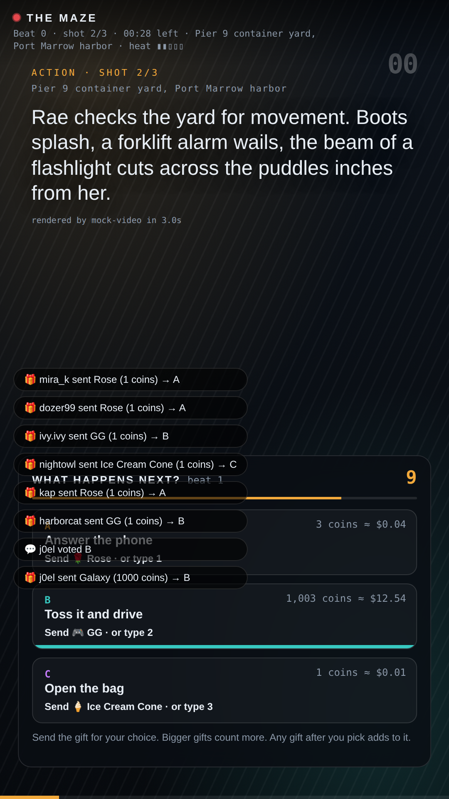
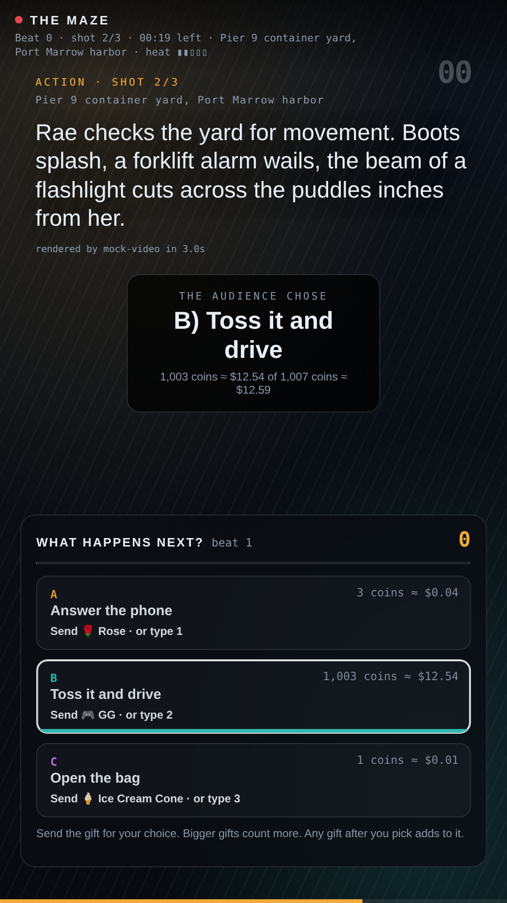

# Go live on TikTok: the hookup, step by step

This is the non-technical walkthrough. Nothing here needs code changes. Budget an afternoon for the first rehearsal.

## What you need

- A TikTok account that is allowed to go LIVE (18+, and LIVE access, which usually means 1,000+ followers).
- A Mac or Windows computer that will run the show and the streaming app. Any recent laptop is fine; the heavy lifting (video generation) happens on fal's servers.
- A fal.ai account with money on it (the show costs about $3.84 per 45-second beat at list price) and an Anthropic API key for the writer.
- One of these streaming apps:
  1. **Streamlabs Desktop** (free). It has an official TikTok login, so you do not need a stream key: apply for TikTok LIVE access inside Streamlabs, log in with your TikTok account, pick TikTok as the destination. Recommended.
  2. **TikTok LIVE Studio** (TikTok's own desktop app). Overlays are added as a "Link" (web page) source.
  3. **OBS Studio** with a TikTok RTMP stream key. Only some accounts get a key (established accounts, or through a TikTok Creator Network agency).

## Step 1: run the show on your computer

1. Install Node.js (nodejs.org, the LTS version) and download this repository.
2. In a terminal inside the folder: `npm install`.
3. Copy `.env.example` to `.env` and fill in:
   - `FAL_KEY=` your fal key
   - `ANTHROPIC_API_KEY=` your Anthropic key
   - `TIKTOK_USERNAME=` your TikTok handle without the @
   - `ASPECT=9:16` (portrait, for TikTok)
   - `CONTENT_MODE=tiktok` (keeps weapons and fights off screen, per TikTok LIVE rules)
   - leave `RENDERER=clips` unless you are testing Director mode
4. Lock the cast's look once: `npm run cast`. Look at the images in `story/cast/`. If you don't like a face, delete that character's entry in `story/bible.json` and run it again. Once you like it, never run it again for that character.
5. `npm run demo`. The terminal prints `web player on http://localhost:8787`. Open it in a browser and watch a few beats. That page is for website viewers; the one for the stream is the next step.

**Dry run without money:** leave `FAL_KEY` blank and the show runs with storyboard cards. The player then shows a "Simulate TikTok" panel (Rose, GG, Ice Cream, Galaxy, a comment, a crowd burst) so you can see exactly how gifts move the vote and how the overlay reacts, before spending a cent or going live.

## Step 2: put the show on your stream

The stream is a web page: `http://localhost:8787/?tv=1`. It shows the video, the vote panel, gift toasts and the winner card, in portrait.

- **Streamlabs Desktop:** Sources → add **Browser Source** → URL `http://localhost:8787/?tv=1`, width 1080, height 1920 → drag it to fill the canvas (set the canvas to 1080×1920 portrait in Settings → Video). Add your webcam as a small source in a corner if you want a host on camera (TikTok's LIVE guidance likes a face on screen). Go Live → destination TikTok.
- **TikTok LIVE Studio:** add a **Link** source with the same URL, size it to the full portrait canvas, then Go LIVE.
- **OBS:** Browser Source with the same URL; Settings → Stream → Custom → paste TikTok's server URL and stream key from livecenter.tiktok.com/producer.

Sound: the video clips carry their own audio and dialogue. In the streaming app make sure the browser source's audio is captured ("Control audio via OBS/Streamlabs" on, monitor off).

## Step 3: connect the votes

As soon as your LIVE is on air, the show (still running from Step 1) connects to your LIVE room using `TIKTOK_USERNAME` and starts reading comments and gifts. You will see `tiktok: connected to @yourhandle` in the terminal. If it says "connect failed", you are not live yet or the room could not be found; it retries every 30 seconds.

Optional but recommended for busy rooms: a free Euler Stream key (eulerstream.com) in `EULER_API_KEY=` makes the connection more reliable.

Test it: have a friend send a Rose during a vote. Their name appears as a toast on the stream, the A bar grows by 1 coin, and the terminal logs the gift.

## What viewers see on TikTok

 

Everything is drawn into the video, because TikTok does not allow custom buttons in its player:

- **Between votes:** the story, with a small line at the top (beat number, time left, location).
- **When the vote opens** (15 seconds into every beat, the moment the second shot starts): a panel slides up from the bottom with a 10-second countdown and three rows, one per option: the gift icon and name to send ("🌹 Rose" / "🎮 GG" / "🍦 Ice Cream Cone"), the option's title, and a bar that grows with the total coin value of gifts for it. Under it: "Send the gift to vote. Any gift after you pick adds to it. Biggest total wins."
- **While it is open:** each gift shows as a small toast ("mira_k sent Rose → A"); comments "1", "2" or "3" also pick and show as toasts. TikTok's own gift animations play on top of everything as usual.
- **When it closes:** the winning row lights up and a card says "The audience chose: B) Kill the light — 1,240 of 1,900 coins". If nobody voted: "Nobody voted, the careful option wins by default."
- **The story continues** with the winning option as the fourth clip.

Change the three gifts in `.env` (`TIKTOK_GIFT_A/B/C`) to whatever cheap gifts you prefer; names must match TikTok's gift names exactly.

## Rules to keep in mind while live

- Label the LIVE as AI-generated (TikTok requires it for realistic AI content).
- No weapons or fights on screen (already enforced by `CONTENT_MODE=tiktok`).
- Do not show QR codes or send people off TikTok to buy anything.
- No prizes and no randomness in the vote: highest total wins, always.
- Keep a human in the loop: watch the director's log in the browser window for content rejections and fillers.

## If something goes wrong

- **Fillers every beat:** the render is slower than the 20-second window. Set `TURBO_FOR_DEADLINE=true`, or `SPECULATION=full` (pre-renders all three options' first clips, costs about 1.7× on video).
- **"content_policy_violation" in the log:** the writer produced something fal will not render; the filler covers it and the next beat continues. Tighten the bible if it keeps happening.
- **Votes not counting:** check the terminal says `tiktok: connected`; make sure the gift names in `.env` match; try an `EULER_API_KEY`.
- **The stream page shows storyboard cards instead of video:** `FAL_KEY` is blank or the fal balance is empty.
